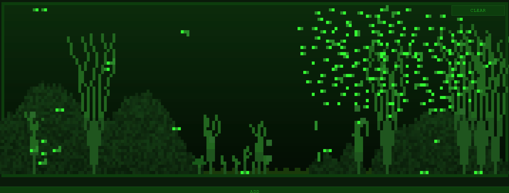

# Tamofishi

A pixel-art aquarium simulator rendered on a single HTML canvas. Stock your tank with fish, crabs, snails, turtles, shrimp, plants, and rocks, then watch the ecosystem play out.



## Play

- **Web**: [tamofishi.vercel.app](https://tamofishi.vercel.app/)
- **Mac**: Download `Tamofishi-0.1.0-arm64.dmg` from [Releases](https://github.com/DJSethDuncan/tamofishi/releases)
- **Windows**: Download `Tamofishi Setup 0.1.0.exe` from [Releases](https://github.com/DJSethDuncan/tamofishi/releases)

> **Mac note**: macOS will block the unsigned app. Right-click the app and choose **Open** to bypass Gatekeeper the first time.

## Controls

- **Click the water surface** to drop food flakes
- **Click an animal** to spook it
- **Drag** snails, plants, and rocks to reposition them
- **ADD** button spawns new entities
- **CLEAR** removes all entities from the tank
- Fish and crabs will follow your cursor

## Entities

### Fish

School together, bob as they swim, and grow through three life stages: babies (single bright pixel), juveniles (two pixels), and adults (three pixels with an animated tail). Adults hunt shrimp. Females breed every few hours, producing small clusters of babies. Panic and scatter when crabs approach.

### Crab

Bottom-dwellers that scuttle along the sand, climb rock faces, and scale tank walls. Hunt fish and shrimp. Animated legs alternate as they walk. Panic when turtles get close.

### Snail

Crawl slowly along the floor and up walls, tracing the tank perimeter. Attracted to plants and will climb them. Can be picked up and dragged anywhere in the tank.

### Turtle

Large, slow predators that lumber along the bottom. Hunt fish and occasionally crabs. Climb rocks. Their bulky shell sprite changes shape between walking and resting.

### Shrimp

Tiny and quick, shrimp walk along surfaces and perch sideways on plant stalks for long stretches. Babies appear as single bright pixels before growing into their full form. Females breed once mature. Panic and dart away when fish or crabs get close.

### Plants

Swaying stalks rooted to the sand floor. Come in small, medium, and large sizes. Shrimp perch on them, snails climb them. Draggable.

### Rocks

Procedurally-generated terrain with bumpy surfaces. Crabs and turtles climb over them. Affect the floor height for nearby entities. Draggable.

## Food chain

```
Turtle --> Fish --> Shrimp
  \--> Crab --> Fish
         \--> Shrimp
```

All animals eat food flakes dropped from the surface.

## Run locally

```bash
git clone https://github.com/DJSethDuncan/tamofishi.git
cd tamofishi
npm install
```

**Electron (desktop)**:
```bash
npm start
```

**Browser**:
```bash
npx serve .
```
Then open `http://localhost:3000`.

## Build

```bash
npm run build:mac    # builds to builds/*.dmg
npm run build:win    # builds to builds/*.exe
npm run build:all    # both
```

## Mobile (iOS + Android)

Mobile development lives on the `mobile` branch. The `src/` directory on `main` is the source of truth — the mobile app is a Capacitor wrapper around the same web content.

### Setup (first time on a new machine)

```bash
git checkout mobile
cd mobile
npm install
npx cap add ios
npx cap add android
```

### Day-to-day workflow

1. Make game logic changes on `main` in `src/` as normal
2. Merge `main` into `mobile` to pull in updates
3. From the repo root, rebuild the web assets:
   ```bash
   npm run build:mobile
   ```
4. From `mobile/`, sync assets into the native projects:
   ```bash
   cd mobile && npx cap sync
   ```

### Open in Xcode / Android Studio

```bash
cd mobile && npx cap open ios      # Xcode
cd mobile && npx cap open android  # Android Studio
```

### Notes

- `mobile/ios/` and `mobile/android/` are gitignored — regenerate them with `npx cap add ios/android` after `npm install`
- `cursor.js` uses `mousemove` which doesn't fire on touch screens — touch event handling is a `mobile` branch concern, not `main`

## Tech

Vanilla JS, HTML Canvas, zero runtime dependencies. Electron for desktop builds. All rendering is done on a tiny 180x60 canvas scaled up with `image-rendering: pixelated`. State persists via Electron IPC (desktop) or localStorage (web/mobile).
